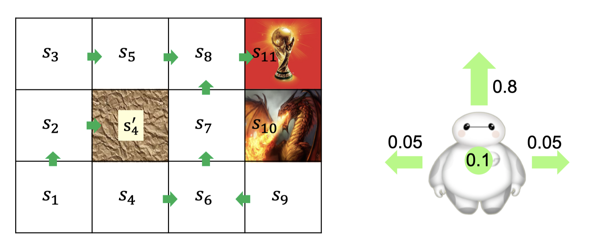
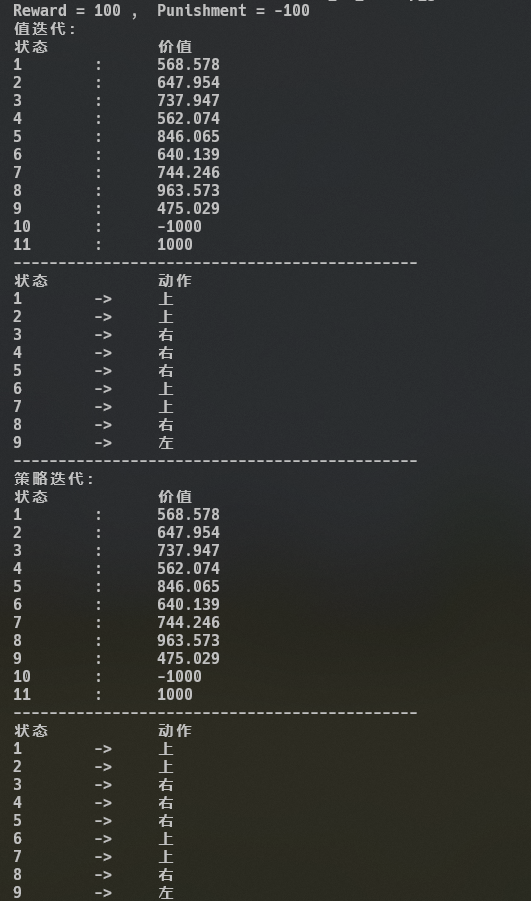
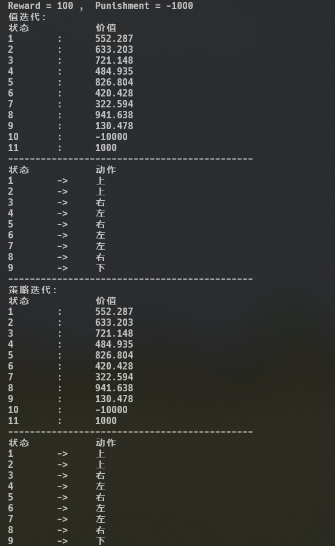
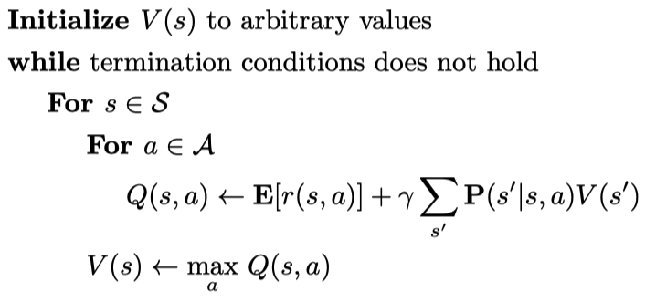
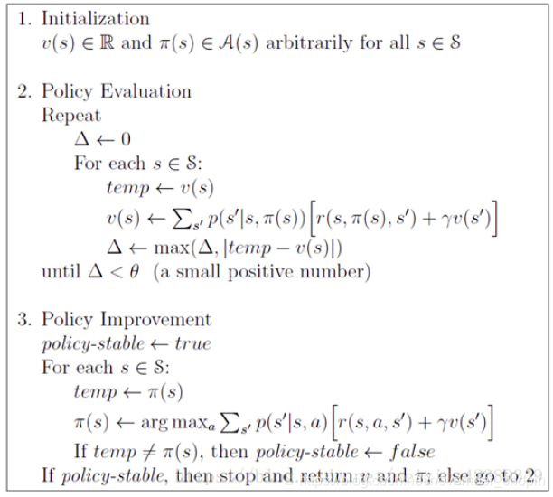

2021年算法分析与设计附加题

**实验题目：**马尔科夫决策过程MDP

使用值迭代（Value-Iteration）和策略迭代（Policy-Iteration）求解网格空间寻路问题。

**实验背景：**

如图的网格空间中，一只大白想要拿到大力神杯，并且不想被恶龙杀死。请你作为一个全知者帮助大白规划在每一个位置（1~9）应该往哪里走。

详细描述：

1. 向上、向下、向左、向右四个指令（Action）分别用0、1、2、3代替。
2. 大白的行为并不总是按照指令来，即如果你向大白发出向上的指令，大白会有0.8的概率向上走，会有0.1的概率留在原地，各会有0.05的概率向左或者向右走。
3. 拿到大力神杯会获得Reward，被恶龙杀死会被Punish。
4. 大白撞到地图边界或者s4'那堵墙会留在原地。

**实验细节：**

1. 本题为附加题，满分为前四次实验的一半（5分），仅实现值迭代得两分，仅实现策略迭代得三分
2. 语言不限，但助教会提供C++版本的一个简单框架，算法需要同学们自己实现。
3. 检查时助教会验证算法正确性，并会询问代码编写思路。

**附录：**

附录0：ML相关链接
https://github.com/cwzsquare/MDP/blob/master/Lec13.pdf

附录A：贝尔曼方程（Bellman Equation）
$$
V^\pi(s)=\mathbf{E}[r(s,\pi(s))]+\gamma\sum_{s'}\mathbf{P}(s'|s,\pi(s))V^\pi(s')
$$
附录B：输出结果示意A（Reward=100，Punishment=-100）

输出结果示意B（Reward=100, Punishment=-1000）

附录C：值迭代伪码：

策略迭代伪码：

附录D：补充材料

https://inst.eecs.berkeley.edu/~cs188/fa20/assets/slides/lec8.pdf

https://inst.eecs.berkeley.edu/~cs188/fa20/assets/slides/lec9.pdf
